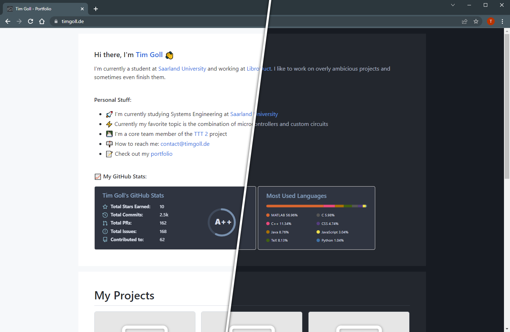

# GitHub based portfolio website

This project aims to create a website that can be hosted everywhere that mirrors personal projects on GitHub, but can be extended by additional projects without creating additional repositories for them.

Once the initial simple setup is done, you will never have to touch the webspace again. Projects are added through commits to your main repository and the content is markdown based.


_(A preview of the automatically generated website)_

As can be seen on the above image, the design includes a dark and a light mode. The selection of those happens automatically based on the system preferences. Moreover the design works flawlessly with mobile devices.

## Setup

For this repository and give it a fitting name. Before uploading it to your webspace, you have to edit a few files.

### Serverside config

Navgiate to `deploy/src/php` and locate the file `config.php`. It should look like this:

```php
<?php
    $config = [
        "raw_base" => "https://raw.githubusercontent.com/",
        "core" => [
            "owner" => "TimGoll",
            "repository" => "github-portfolio",
            "default_branch" => "master"
        ],
        "bio" => [
            "owner" => "TimGoll",
            "repository" => "TimGoll",
            "default_branch" => "main"
        ],
        "api_key" => "xxx"
    ];
?>
```

If your project is GitHub based, the first entry can be left unchanged. The following three have to be changed though.

The `core` one should point to your fork of this repository, the `bio` one should point to your GitHub profile repository.

The API key is optional, but should be added. GitHub limits the API to 60 calls per hour if no API key is used. A key increases that number to 5000. Such a key can be created [here](https://github.com/settings/tokens). You don't have to enable any of the asked permissions, as we don't want to add, remove or change repositories.

### Clientside config

The clientside config is located inside of the `index.html` file. It is split into two speperate parts:

```html
<style>
    .markdown-body,
    .popup-header-content {
        min-width: 200px;
        max-width: 980px;
    }
</style>
```

The first part is used to set the size of the page. These can be changed to fit your personal preferences.

```html
<script>
    var config = {
        origin: "https://raw.githubusercontent.com",
        core: {
            owner: "TimGoll",
            repository: "github-portfolio",
            defaultBranch: "master"
        },
        bio: {
            owner: "TimGoll",
            repository: "TimGoll",
            defaultBranch: "main"
        },
        title: "Tim Goll - Portfolio",
        contact: "contact@timgoll.de",
        copyright: {
            startyear: 2014,
            name: "Tim Goll"
        }
    };
</script>
```

The second part has the clientside config data. The first three entries here mirror the settings already defined on the server and should therefore be identical. The remaining settings should be self explanatory.

### Deploying

Once the config is done, everything inside the `deploy` folder has to be uploaded to the root of your website folder. Then the website structure is ready to be used. Only the projects have to be added now.

## Adding projects

Projects are defined in the `projects.json` file located in the `webcontent/` folder.

### Article types

There are three types of projects that can be defined here. They all look the same to the user, but fetch the data from a different source.

#### Repository readmes

The classic project is a simple link to a repository. Inside of this repository has to be a `README.md` file that is used as the project article.

```json
{
    "name": "ATMega 328pb Breakout",
    "desc": "A simple breakout board to test a 20MHz clocked 328pb",
    "owner": "TimGoll",
    "id": "pcb_atmega328p",
    "default_branch": "main",
    "repo_based": true,
    "date": "xxx"
}
```

The `name` and `desc` are used on the project box in the project view. Both should be short and fitting. The `owner`, `id` and `default_branch` point to the repository where this file is located. `repo_based` sets it to the repository based project type.

#### Extra markdown files

For projects that should be featured on the website but that lack their own repository, project descriptions can be added to the `markdown/` folder inside of the aforementioned `webcontent` folder. The project files should have the same name as the `id` of the project.

```json
{
    "name": "Project B",
    "desc": "Also a short expanation of what is going on",
    "id": "project_b",
    "repo_based": false,
    "date": ""
}
```

Overall this structure is fairly similar to the structure of the repository based project, but it lacks the info about the repository.

#### Static Pages

Static pages aren't really projects at all and are used for pages such as the lagal notice page.

```json
{
    "name": "Legal Notice",
    "id": "legal",
    "repo_based": false,
    "hidden": true
}
```

The important flag here is `hidden`. If a project is hidden, it won't be showed in the prokject list.

Images for the article should be put inside of the `assets/` folder which is next to the `mardown/` folder.

### Preview images

Preview images should be an eye catcher when scrolling through the project list. Put them inside of `webcontent/assets/` and name them the same as the project id. They should be a `png`.

## Automatic caching

While the whole system is GitHub based, it still caches the data on your webserver. This is done with a php script locaed in `deploy/src/php/rebuild_cache.php`.

You can either manually visit this link whenever something changed or you can automate it. Cronjobs or GitHub Actions are two systems that come to mind here.

## Used External Sources

- [GitHub Markdown Stylesheet](https://github.com/sindresorhus/github-markdown-css): The GitHub stylesheets
- [Primer Style](https://primer.style/css): A few style classes are copied to my custom css file

## License

[MIT](LICENSE)
