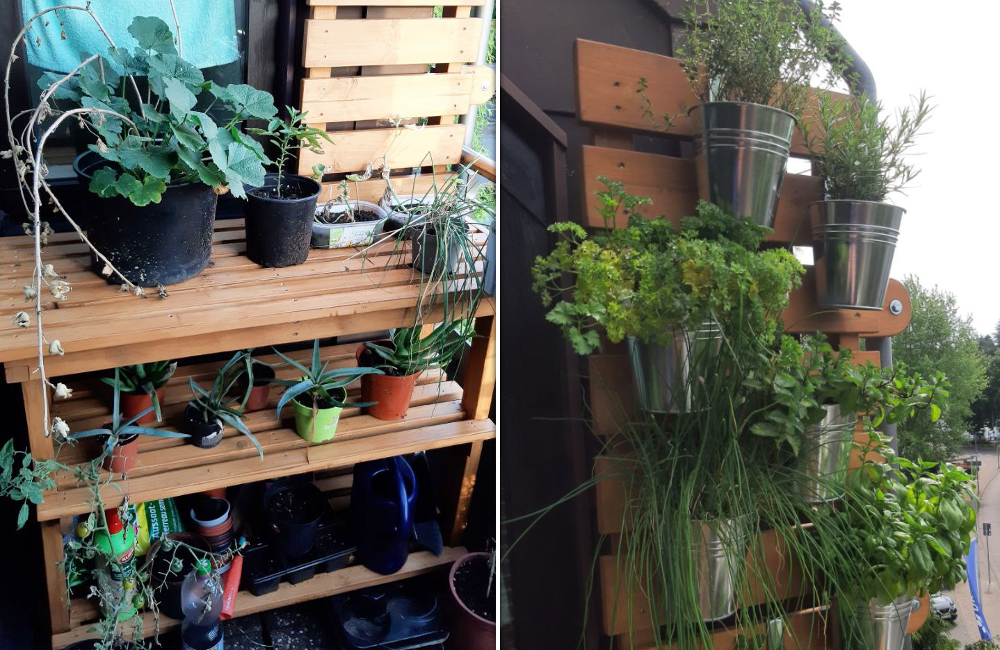
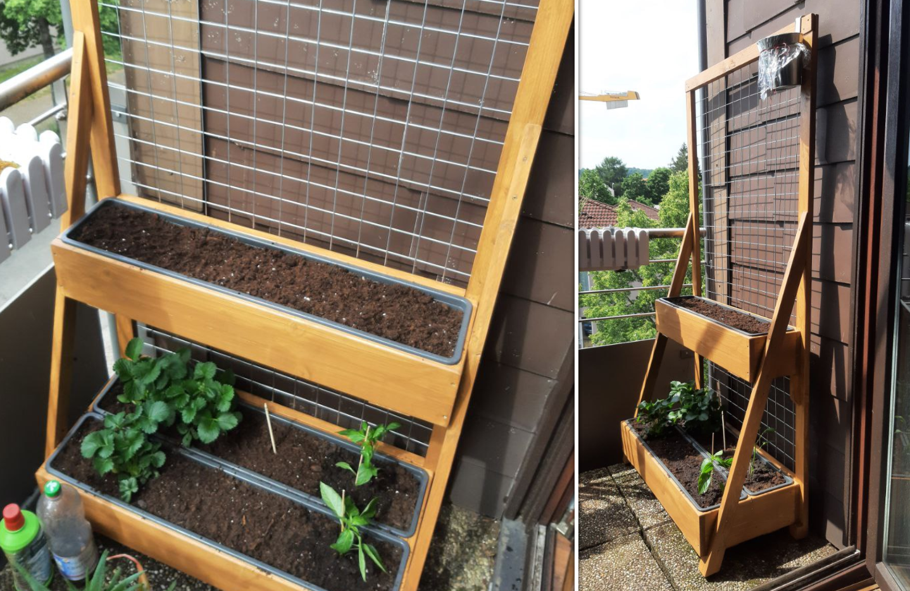

# Balcony Shelves for a Small City Balcony

For years we struggled to use our balcony for anything useful because it is so small and it is impossible to mount something to the walls. We the decided to add to new elements to the balcony: A shelf with a wood cladded wall to mount herb pots and a two story raised bad with a net for climbing plants such as tomatoes.

The first project was a sturdy shelf to store all the related things for gardening: compost, tools, fertilizer, pots etc. Additionally the shelf can be used to place pottet plants in the sun. The backwall has a wood cladded wall that is mounted to the balcony structure with pipe clamps where different herbs can be hung for the most efficient space use.

I used [these galvanized balcony pots](https://www.otto.de/p/astor24-pflanzkuebel-haengetoepfe-zink-blumentopf-garten-balkon-blumen-topf-kraeutertopf-gelaendertopf-6-haengetoepfe-pastell-hochwertig-verarbeitet-S0I2M0XW), shortened the hanger and bent it to fit around the wooden cladding.

_(The shelf with the cladded wall for herbs)_

The second part of the project was inspired by raised beds. To save space, I decided to make a two story raised bed. The lower level is still sunny most of the day and can be used for strawberries, chilies etc. The upper level is intended for tomatoes and other plants that have to be tied to something.

_(The raised beds with strawberries and space for tomatoes)_
