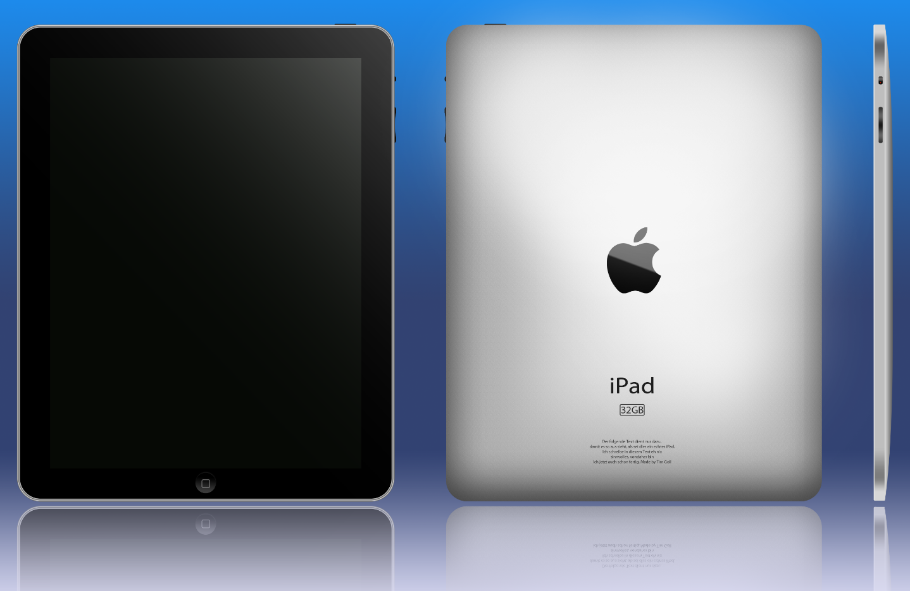
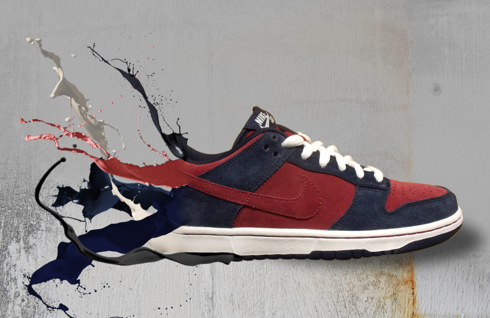

# Digital Product Drawing

One of my first projects that I posted on facebook at that time were digital drawings done in Photoshop. I was familiar with that program since being a child due to my father's work, but I got curious to learn more about this program in my teenage years. The following two images were results of these learning projects.

_(The first gen iPad drawn from scratch)_

The first gen iPad was just released a while ago when I drew this. It took three attempts to get a convincing result that I then posted on facebook.

_(A nike shoe being liquified)_

Another project, inspired by other images available on the internet at that time, was a liquified shoe. Here the work mostly consisted of cutting out the different elements and color matching the color explosions to the colors in the shoe.
