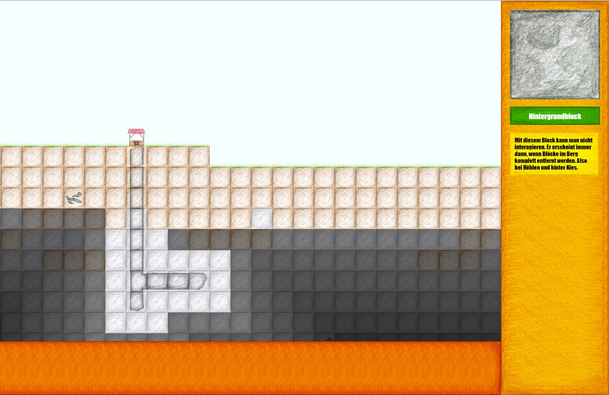
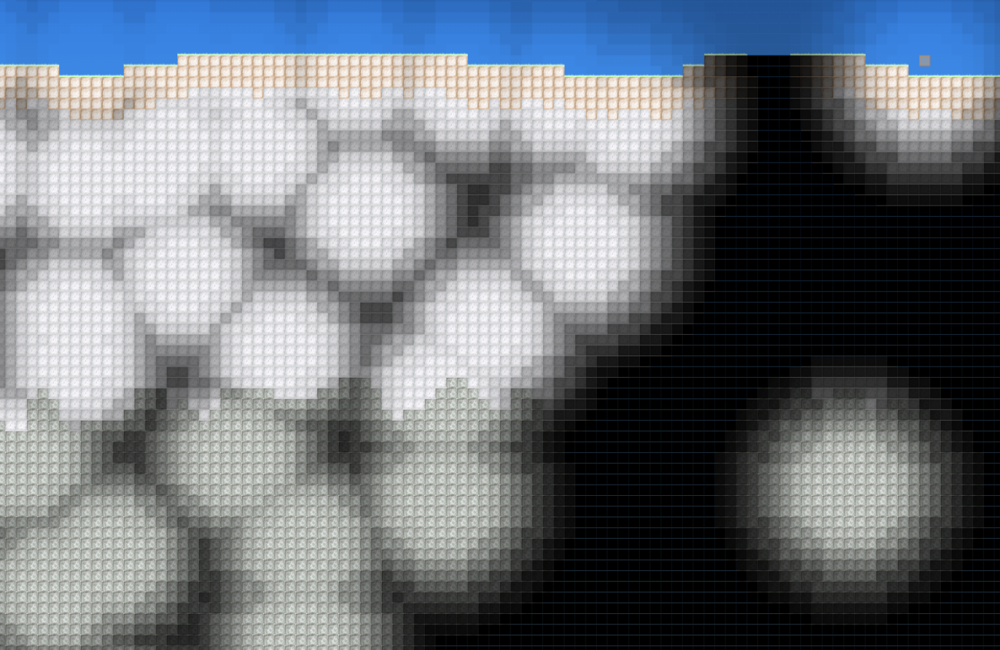
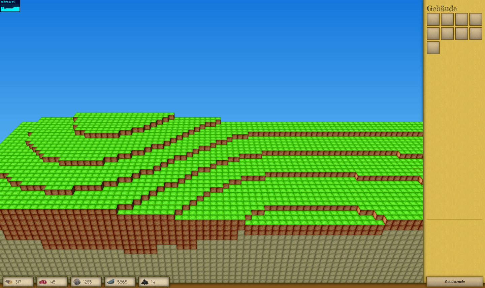
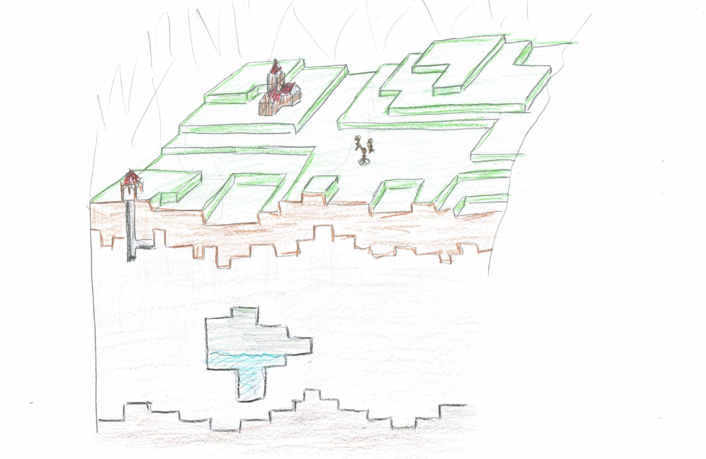

# Turnbased Strategy Game

It all started when I was 10 years old and had the idea to create a paper based game that is a cross between Catan and Age of Empires. This idea stuck in my head for years until I got to the point where I wanted to create my own PC game.

_(The first working prototype)_

I started with javascript on a plain canvas. The textures are handdrawn. You are able to place tunnels which light up the surrounding ground. Also tunnels automatically connect as can be seen in the screenshot. Sadly this version is no longer available.

_(A light engine rework)_

After the initial tests had shown that the system is working, I reworked the map to be bigger and the lighting to be more dynamic. There is a [demo available here](https://gamedev.timgoll.de/Strategie/).

_(The game got 3D)_

My thinking quickly got more ambicious and I decided that I wanted to move this game into a 3D environment with the help of [three.js](https://threejs.org/). This resulted in something that I call 2.5D. It is no real 3D game, but a game with two 2D planes. The underground plane is identical to the previous prototypes, but the overground plane makes the game more interesting and complex.

Over time I also created two update videos ([number 1](https://www.youtube.com/watch?v=QDx-PKFSDbs), [number 2](https://www.youtube.com/watch?v=VEKF_W6a8nQ)) where I talk about the design choices, the multiplayer implementation and the custom camera.

_(The vision)_

On this last image is shown how I envisioned the game. There would be underground mining facilities with overground infrastructure and units that protect your settlement.
