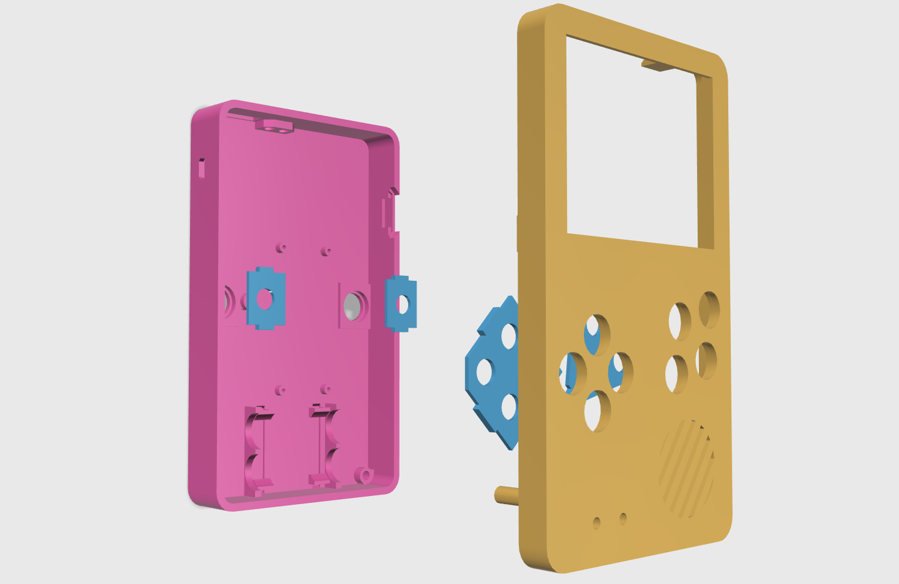
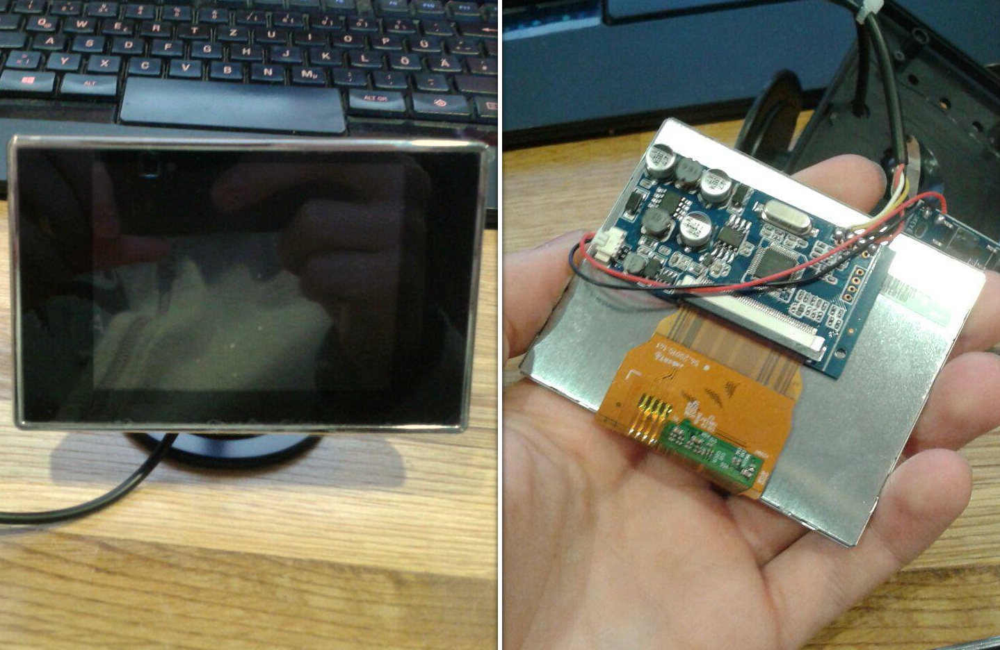
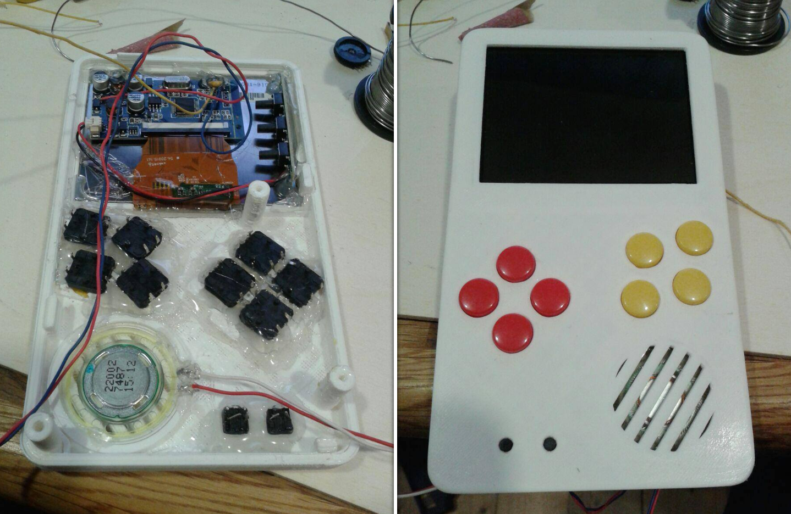
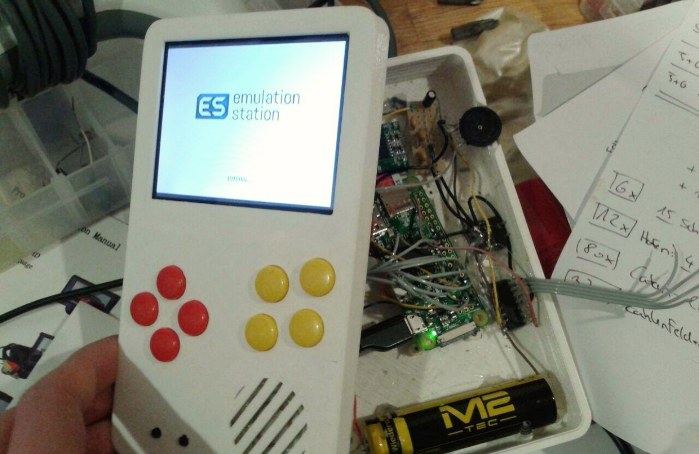

# RetroPi based GameBoy

One of my first homemade electronics projects was a gameboy build with a RaspberryPi Zero. It was also one of the first project where I had to create a more complex 3D model. All in all this project took me less than a week.

_(The 3D model of the gameboy)_

After I knew which parts I planned on using, I started with the 3D modeling of the housing. The design is a homage to the clasic GameBoy with the slight change of a bigger display and four additional buttons.

_(The display is a analog car display)_

One of the major components of this build was the display. I chose to use this specific analog car display, because it was already used by many other people that did a similar project. I could therefore rely on their previous experiences.

Since this display was designed for a 12V car battery, it was incompatible with the 5V system of the GameBoy. Luckily for me the display runs on 5V as well because it has an internal 12V to 6V DC-DC converter. I unsoldered the main IC of this converter and used on of its pins as my 5V input.

_(The interior and exterior of the front panel)_

The buttons, the speaker and the display were glued into place and then wired up. In this picture the whole assembly still looks structured, but it got messy really fast.

_(The GameBoy up and running)_

The final assebly showed that the whole system worked. Of course there were a few bugs to fix at first, but all in all it worked as expected. A nice bonus is that you couldn't even see the included mess once the housing was closed.

It is battery powered and has a USB charging port. While the battery isn't the best, it is good enough for a quick break from work on the couch. At some point I should probably do a second version of this.
