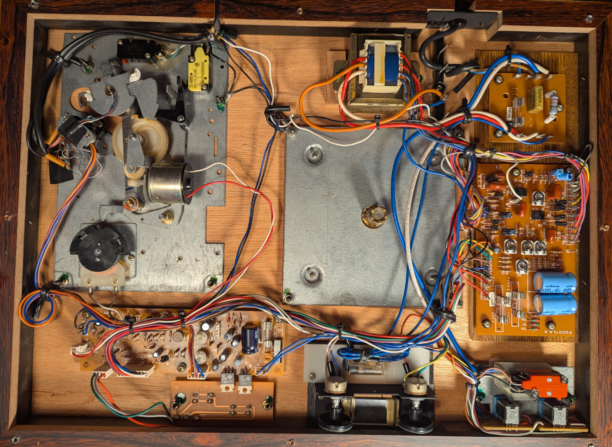
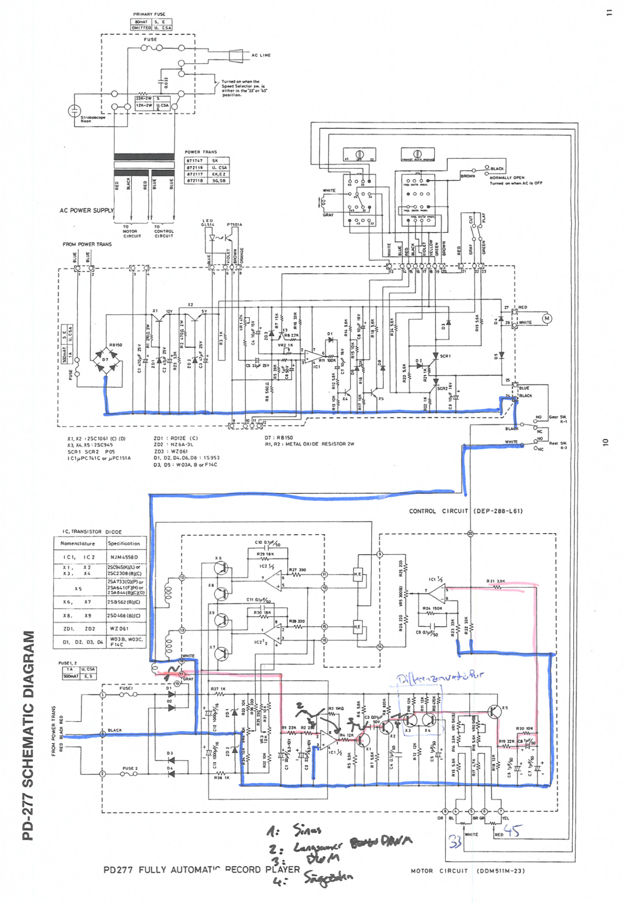
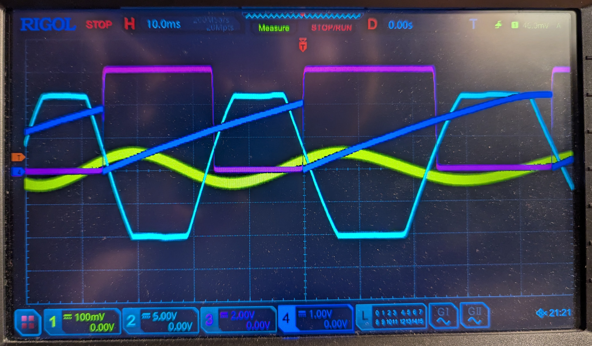
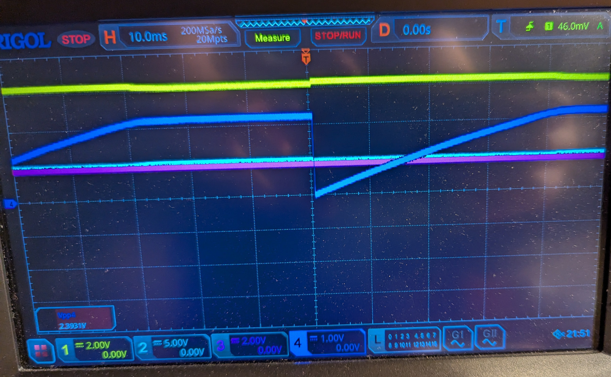
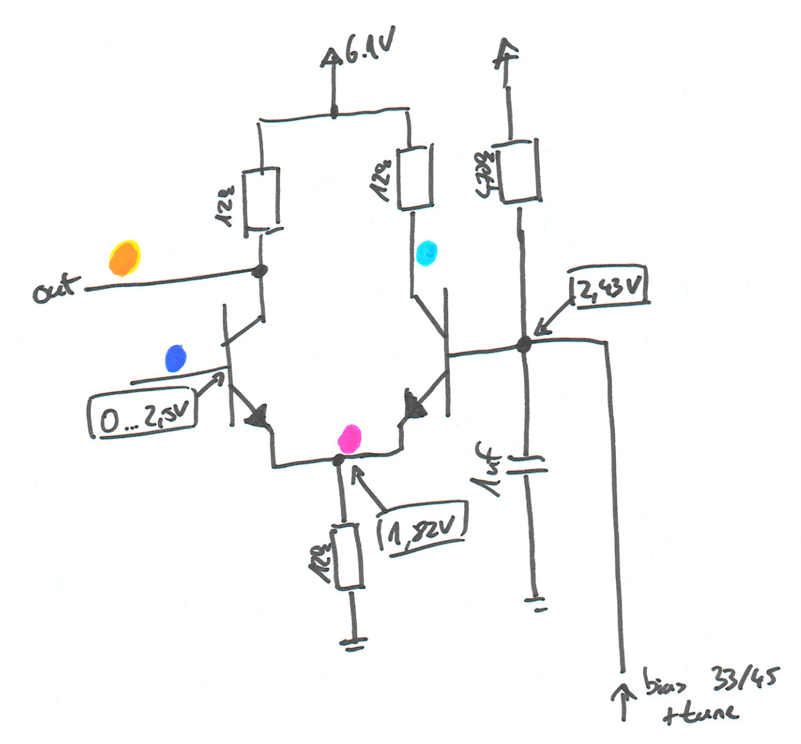
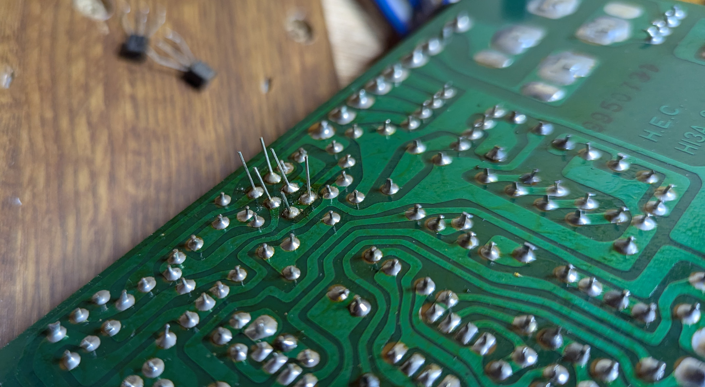

# Luxman PD277 Repair

My dad got this Luxman PD277 gifted in the early 2000s. The previous owner ran a record shop and was unable to repair it himself, so he passed it on. Since then it has been collecting dust. Time to change that.

The PD277 is a fully automatic record player from somewhere between the late 70s and early 80s. Wooden case, automatic tonearm, and the interesting part: a direct drive motor. No belt, no idler wheel, the platter sits directly on the motor shaft. And exactly that part was broken: the tonearm still did its thing, but the platter didn't rotate.

_(the underside with the bottom cover removed, motor control board on the right)_

## Not the First One

A quick search shows I'm not alone with this. There are quite a few forum threads about PD277 players with a platter that won't spin:

- [StereoNET: Luxman PD-277 issues, motor not spinning](https://www.stereonet.com/forums/topic/89507-luxman-pd-277-issues-motor-not-spinning-help-please/)
- [AudioKarma: Luxman PD-277 motor will not start](https://audiokarma.org/forums/threads/luxman-pd-277-motor-will-not-start.771982/)
- [Vinyl Engine forum thread](https://www.vinylengine.com/turntable_forum/viewtopic.php?t=135936)
- [UK Vintage Radio forum thread](https://www.vintage-radio.net/forum/showthread.php?t=164637)
- [Old Fidelity Forum: Luxman PD277 Teller dreht nicht](https://old-fidelity-forum.de/thread-7348.html) (German)

Reading through them is a bit frustrating. Repair technicians gave up because the service manual only contains the schematic without any explanation or test voltages, others replaced transistors and ICs without success. A few people did get their players running again by swapping all small-signal transistors on the motor control board, but nobody really explained *why* that worked or which part was actually dead.

So instead of swapping parts at random, I wanted to understand the circuit first.

## How the Speed Control Works

The motor is a brushless DC motor, so the platter speed has to be regulated electronically. A sensing coil delivers a sine wave whose frequency depends on the platter speed. This signal runs through a chain of stages and ends up controlling the motor drive again. It's essentially one big feedback loop.

_(the schematic with my markings, the red path is the speed feedback signal)_

Following the red path, the signal goes through these stages:

1. The **sensing coil** delivers a small sine wave, roughly `100mV`.
2. The first half of **IC1**, an opamp, turns it into a slow square wave with rather lazy edges.
3. The NPN transistor **X1** cleans this up into a proper square wave.
4. After a capacitor, every edge of the square wave produces a short spike. These spikes reset a ramp generator around **X2**, creating a **sawtooth**. The ramp rises at a fixed rate, so the slower the platter, the longer it has until the next reset and the higher it climbs.
5. A **differential amplifier** made from **X3** and **X4** compares this sawtooth against a reference voltage. The reference is set by the speed trimmers for `33` and `45` rpm. If the sawtooth climbs above the reference, the platter is too slow and **X5** gives the motor more drive.

So the whole thing is basically a frequency-to-voltage converter built from a ramp generator and a comparator. Pretty elegant for something designed almost 50 years ago.

## Finding the Fault

I probed my way along the signal path. Everything up to the differential amplifier looked as expected:

_(yellow: sensing coil, light blue: IC1 output, purple: after X1, dark blue: sawtooth at the differential amplifier input)_

After the differential amplifier, nothing came through. The output just sat at a constant `6V`, with a bit of wiggle when turning the platter by hand, but nothing usable.

When the platter turns slowly, the sawtooth has enough time to run into its plateau at around `2.5V`. That's above the reference voltage, so the differential amplifier should switch. It didn't.

_(slow rotation: the sawtooth reaches its plateau, the output stays flat)_

To make sense of it, I drew out the differential amplifier and measured the DC voltages:

_(hand drawing of the differential amplifier with measured voltages)_

The measurements give it away:

- The common emitter node sits at `1.82V`. That means about `1.82V / 12kΩ ≈ 150µA` flows through the tail resistor.
- In a working differential amplifier, that current flows through the collectors. `150µA` through a `12kΩ` collector resistor drops about `1.8V`, so the conducting side's collector should sit at around `6.1V - 1.8V ≈ 4.3V`.
- Both collectors were at about `6V`. So there was basically no collector current at all.

If the tail current isn't coming through the collectors, it has to come in through the base-emitter junctions. The transistors were working as simple diodes without any current gain, which is a typical failure mode of a dead transistor. The emitter voltage fits too: the reference is at `2.43V`, minus one diode drop is exactly the `1.82V` I measured.

## The Fix

I replaced **X3** and **X4** with new `2SC945` NPN transistors, the type listed in the service manual. **X5** got a new `2SA733` PNP as a precaution, even though a defect there would rather pull the output down than leave it stuck at the supply voltage. The culprit was X3, X4, or both.

One thing to watch out for when doing this yourself: according to the forum threads, some `C945` replacements have a different pin order than the originals. Check the pinout of whatever you buy before soldering it in.

_(the motor control board, X3 and X4 are on the left side and already replaced)_

After that, the platter spun again. I then recalibrated everything: first the trimmers on the PCB, which do the rough speed adjustment, and then the user-facing speed controls on the top, which are only meant for fine-tuning.

## Result

The PD277 is running again and plays records as it should, after roughly two decades in storage. The fix itself was cheap, just a few small-signal transistors. The hard part was understanding the circuit well enough to know where to look.

If you have a PD277 with a platter that won't spin, the motor control board is the place to start. Before swapping parts, measure the DC voltages around X3 and X4. If both collectors sit at the supply voltage while the emitter node is at around `1.8V`, you've found your problem. And if they look fine, work your way back along the signal path with an oscilloscope like above.
