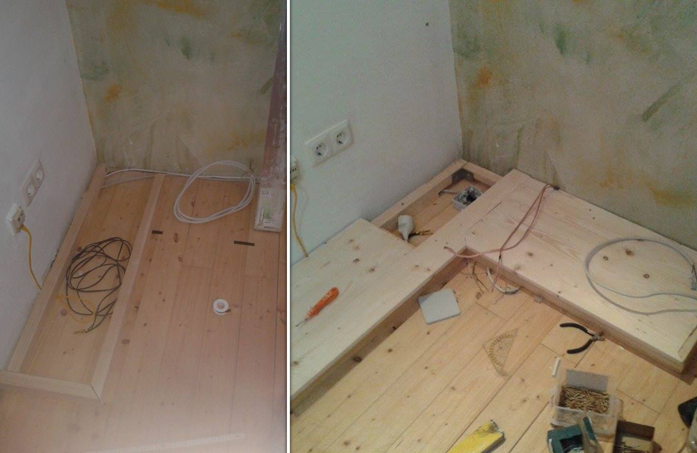
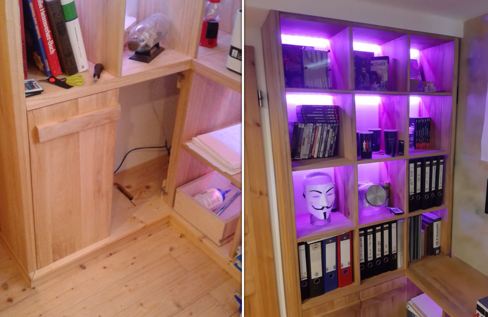

# Open Billy-Inspired Shelf

For optimal space use I wanted to add a fitting shelf in the corner of the room. Inspired by the well known Ikea Billy shelf I designed my own version of it that uses the avilable space and fits the room. One important thing for me was the lighting, each cabinet should be lit up by an invisible LED strip.

_(The shelf base being built)_

After building the base that contains all the wiring and connections, I continued with the shelf itself. There are no visible screws in this built since I used wooden pins in combination with hidded screws. For exampe the horizontal layers are screwed to the side before I glued the second wooden panel in place.

_(The doors are mounted and the shelf is lit up)_

After adding doors to the lower part of the cabinet the shelf was finished. It can be used to store documents, books or to display possessions.
