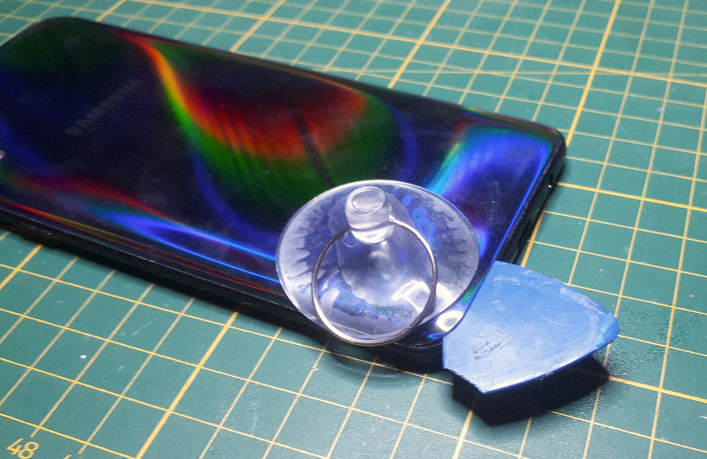
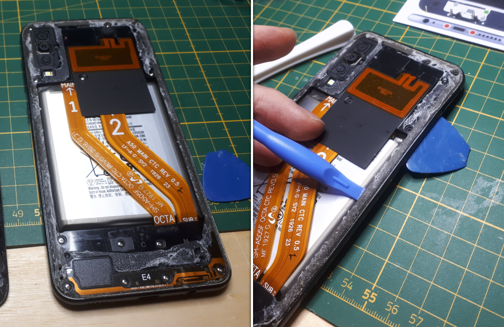
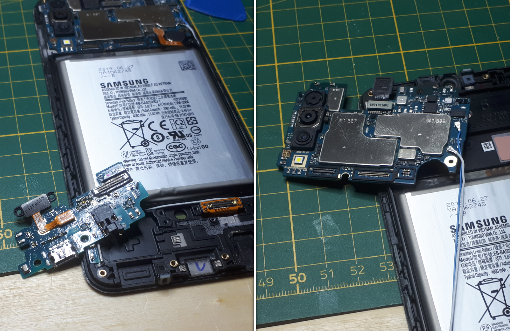
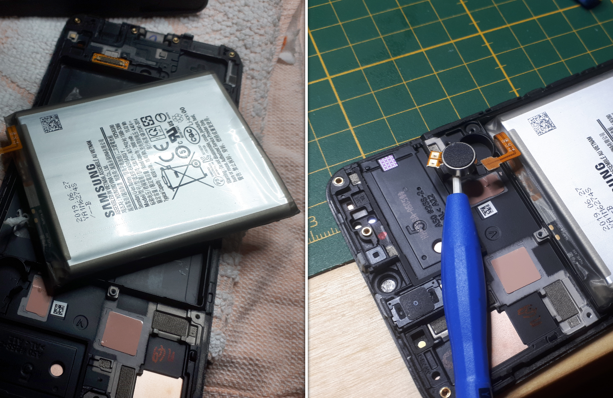
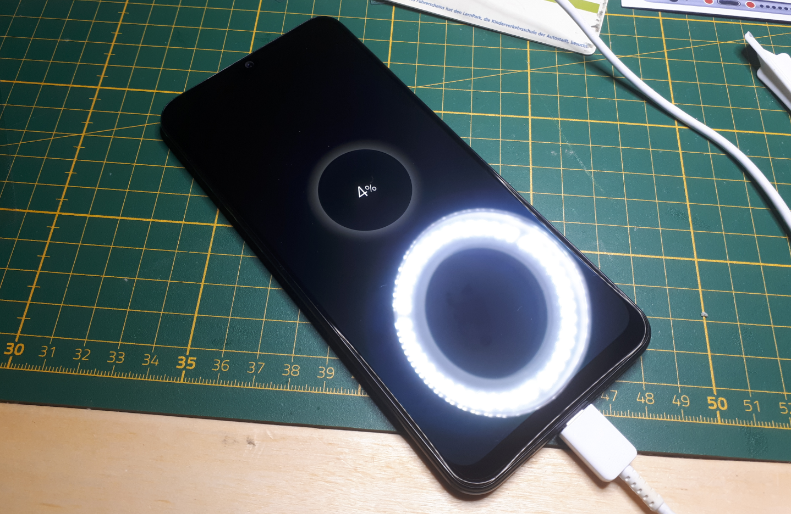

# Smartphone Repair

This smartphone repair project is a placeholder for multiple deviced that I have repaired over the years. Once I understood how these devices are build, the repair became relatively easy because it is the same most of the time.

For this project, I had to replace a broken screen. The first step was to remove the backpanel. Since the backpanel is glued to the housing, I had to slowly heat it up with my heatgun set to 150°C. This process was slow and tedious, but I had to be careful to not destroy the insides of the device.

_(step 1: the removal of the backpanel)_

Fter opening the device, it had to be disassembled further. In the following photo montage it can be seen how I ewmoved the rim and the internal PCBs. All of that had to be done, since the display unit is the core unit of the phone and all parts had to be put inside the new display.

_(step 2: removal of the rim)_

_(step 3: removal of the PCBs and other components)_

Like mentioned before, after the disassembly followed the assembly. It was mostly straighforward. It should be mentioned here though, that the repairability would be greatly improved if the removal of the battery wasn't as painful as it was here.

_(step 4: remounting everything in the new display)_

After the final assembly the device has to be recharged and tested. Luckily everything worked again and I had my working phone back.

_(step 5: working phone)_
