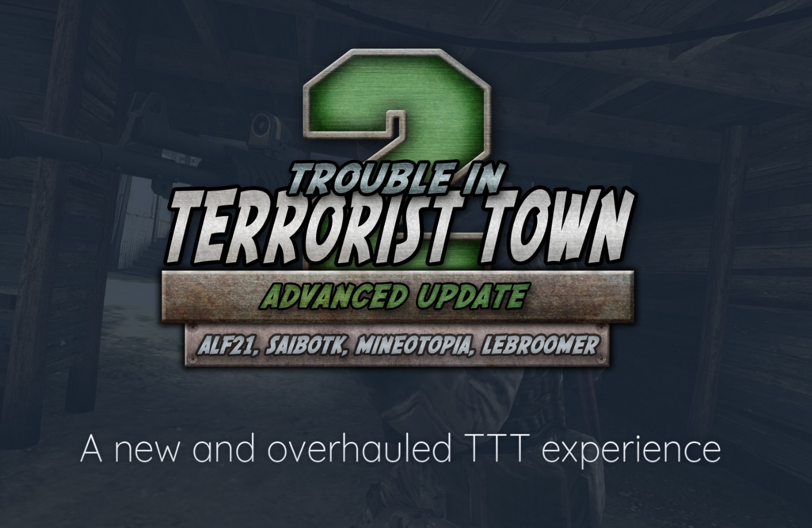
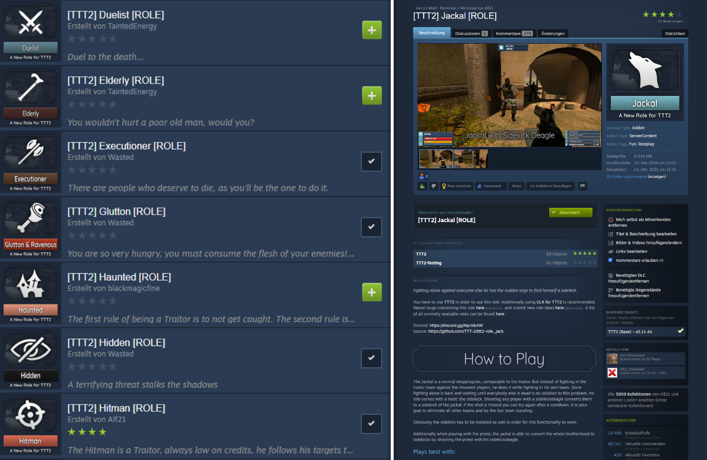
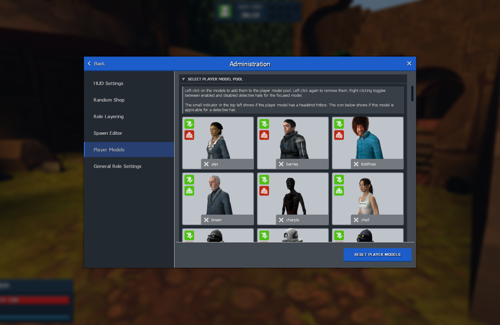

# Trouble in Terrorist Town 2

_Trouble in Terrorist Town 2_ (TTT2) is the biggest project I took part in in the last few years. It all started in 2018 when Alf21 decided to start this mod. I joined roughly half a year later and contributed to the project eversince then.

**Important Links:**

* [TTT2 on Steam](https://steamcommunity.com/sharedfiles/filedetails/?id=1357204556)
* [TTT2 on GitHub](https://github.com/TTT-2/TTT2)
* [TTT2 Organization on GitHub](https://github.com/TTT-2)
* [Documentation](https://docs.ttt2.neoxult.de/2)
* [API Docs](https://api-docs.ttt2.neoxult.de/)
* [Discord](https://discord.gg/Npcbb4W)

## What is TTT2?

TTT2 is a spriritual successor to the beloved [GMod](https://gmod.facepunch.com/) gamemode [Trouble in Terrorist Town](https://www.troubleinterroristtown.com/), a werewolf like social deduction game written in [lua](https://www.lua.org/). Initially TTT2 only aimed at creating a framework such that other addons could create custom roles for the gamemode. Over time however it got transformed into a completely reworked and modular gamemode that gained lots of popularity.

By now the [core gamemode](https://steamcommunity.com/sharedfiles/filedetails/?id=1357204556) alone has more than **125.000** active subscribers on steam. Our main development team consits of 6 people and we received contributions from more than 30 users.

Another metric to measure the activity of the community is the amount of addons that are created for our mod. One such type of addons is a role addon. By now, [more than 75 roles](https://steamcommunity.com/workshop/filedetails/?id=1737053146) have been created either by us or some community members. This is such an impressive number and neither of us expected anything like this when we started.

## What I learned

Besides the obvious things such as coding, project structure and design, many more things challenged me. The management and moderation of an [active discord community](https://discord.gg/Npcbb4W) nearing the 1.000 users and the general challenge of managing an open source project, milestones and issues are only two of the many things I learned while working on this project.

## Collaberations

After a while a while we got into contact with different YouTubers and streamers. While there were many of them, a closer collaboration happened with three of them. Many thanks go to [Dhalucard](https://www.youtube.com/channel/UCZTqRQYguJre4_fwluoJhUA) who was our entry way to the scene and brought us into contact with [PietSmiet](https://www.youtube.com/c/pietsmiet). Also the whole group around [Hand of Blood](https://www.youtube.com/c/HandOfBlood) worked with us for a while.

## A selection of core features

### Coorperate design

Strictly speaking not a feature itself, but one of our core elements right from the get go. Besides the obvious, [a stye guide](https://docs.ttt2.neoxult.de/developers/content-creation/icon-and-design-guideline/) for the in-game appearance of addons, we also put great emphasis on the outside presentation of those addons. This means that a consistent style should be used for icons, texts and preview images. This made our the addons stand out in the steam workshop.

_(our coorperate design is used by our addons as well as by those created by the community)_

### UI based settings

One of the things that became clear during the early stages of the project is that it is really hard to show the users the available features and settings when they have to look them up in a wiki. So over time we created our custom menu system that exposes all available settings in a UI.

The best thing is though, that we created an [easy to use interface](https://github.com/TTT-2/ttt2mg/blob/master/lua/terrortown/menus/gamemode/server_addons/ttt2mg.lua) such that addons can effortlessly add their own settings to the menu.

_(All settings are accessible via UI, no external tools are needed)_

### Customizable and Extensible

There are many more things that we did. But they would make this article a whole book. The most interesting things can be found on our [steam page](https://steamcommunity.com/sharedfiles/filedetails/?id=1357204556), all details are in our [changelog](https://github.com/TTT-2/TTT2/blob/master/CHANGELOG.md).

## Addons that I worked on

TTT2 itself consits of more than just the core mod. It is designed to me modular and highly customizable. Therefore the content itself is often outsourced to additional addons that integrate with the core mod.

* [Trouble in Terroristtown 2 (Core)](https://steamcommunity.com/sharedfiles/filedetails/?id=1357204556): The core addon that makes everything else possible
* [TTTC (Core)](https://steamcommunity.com/sharedfiles/filedetails/?id=1368035687): An addon that assigns custom role-independant attributes to players
* [TTT2 Heroes](https://steamcommunity.com/sharedfiles/filedetails/?id=1877141086): A custom gamemode for Dhalucard that is all about super heroes
* [Marker](https://steamcommunity.com/sharedfiles/filedetails/?id=1777819207): A role that has the goal to tag every player in order to win
* [Priest](https://steamcommunity.com/sharedfiles/filedetails/?id=1789489722): A role that tries to find innocent players with the help of the holy spirit
* [Pharaoh](https://steamcommunity.com/sharedfiles/filedetails/?id=2002040119): A role that is all about ankhs and revival of the dead
* [3D Pointer](https://steamcommunity.com/sharedfiles/filedetails/?id=2005666160): Shows markers rendered in 3D space to other players
* [Defibrillator](https://steamcommunity.com/sharedfiles/filedetails/?id=2115944312): Revives dead teammates
* [Identity Disguiser](https://steamcommunity.com/sharedfiles/filedetails/?id=2144375749): Equipment to hide your identity in-game
* and [many more](https://steamcommunity.com/id/mineotopia/myworkshopfiles/) ...
